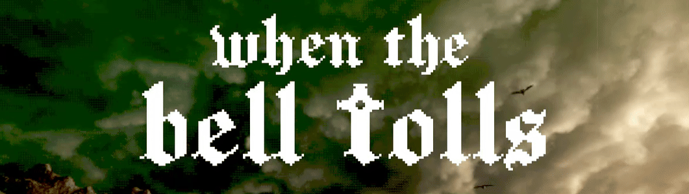

# When The Bell Tolls

When the Bell Tolls is an open-world horror puzzle game developed in Unity, inspired by the haunting aesthetics and gameplay of classic PlayStation 1 and early 2000s horror titles like Silent Hill. This project is our homage to a formative era of survival horror—when fog-covered streets, cryptic puzzles, and lo-fi visuals left a lasting impact on players.

Our motivation was to capture the atmosphere and emotional intensity of that era, while experimenting with modern tools to recreate a retro visual identity. Using a custom dither shader and low-poly models, we’ve crafted a world that feels authentically eerie and nostalgic. The focus is on immersive environmental storytelling, exploration, and psychological tension—rather than action-heavy gameplay.

## ✨ Features

- 🕯️ Open-world exploration with psychological horror elements
- 🧩 Environmental puzzle-solving and subtle narrative
- 🌀 Retro PS1 visual style with custom dithering shader
- 🌫️ Dense atmosphere, ambient soundscapes, and analog horror tone
- 🔦 Minimal UI and diegetic design choices for immersion
